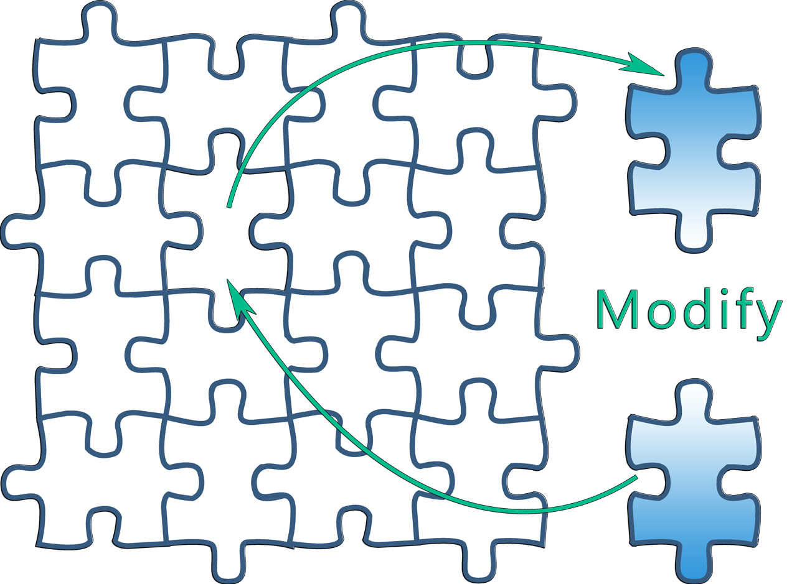

## Brief history of C# #

* Family: **C** <!-- .element class="text-success" -->
* Developed and designed by Microsoft
* Platform: Common Language Infrastructure
* Filename extension: **.cs** <!-- .element class="text-success" -->
* Webpage: https://www.visualstudio.com/

Notes:
.NET languages are all based on the
CLR/CLS and all end up as the same assembly language when compiled


### Object Oriented

```C#
namespace SchoolSystem.DataModels.Abstraction
{
    using System;
    using System.Text.RegularExpressions;
    using static Constraints;

    public abstract class Person : IEntity
    {
        protected Person(string firstName, string lastName)
        {
            this.FirstName = firstName;
            this.LastName = lastName;
            this.ValidateParameters();
        }

        public string FirstName { get; }

        public string LastName { get; }

        public int Id { get; private set; }

        public void SetId(int id)
        {
            this.Id = id;
        }

        private void ValidateParameters()
        {
            var patern = new Regex(NamePattern);

            if (this.IsOutOfRange(this.FirstName) || patern.IsMatch(this.FirstName) == false)
            {
                throw new ArgumentException("First Name is invalid");
            }

            if (this.IsOutOfRange(this.LastName) || patern.IsMatch(this.LastName) == false)
            {
                throw new ArgumentException("Last Name is invalid");
            }
        }

        private bool IsOutOfRange(string name)
        {
            return name.Length < MinNameLength || name.Length > MaxNameLength;
        }
    }
}
```
<!-- .element class="code code-large" -->


<!-- .element style="text-align: left" -->
### OO Basics

* Abstraction
* Encapsulation
* Polymorphism
* Inheritance

Notes:
Encapsulation is the hiding of data implementation by restricting 
access to accessors and mutators. Behind the scenes we can be dealing
with a different data type than the type we are returning.

With abstraction we define functionality but not implementation details
it is used to manage complexity. Software developers use abstraction to
decompose complex systems into smaller components. As development
progress, programmers know the functionality they can expect from as
yet undeveloped subsystems.

Objects can relate to each other with either a “has a” or an “is a” 
relationship. “Is a” is the inheritance way of object relationship.
So, take a library, for example.  A library lends more than just books,
it also lends magazines, audiocassettes and microfilm.  On some
level, all of these items can be treated the same: All four types
represent assets of the library that can be loaned out to people. 
However, even though the 4 types can be viewed as the same, they are
not identical. Without inheritance though, each class must 
independently implement the characteristics that are common to all
loanable assets. Rather than duplicate functionality, inheritance
allows you to inherit functionality from another class,
called a superclass or base class.

Polymorphism means one name, many forms
Polymorphism manifests itself by having multiple methods all with the
same name, but slighty different functionality.
Give an example with rent() an item from the library 


<!-- .element style="text-align: right" -->
### OO Principles

* Encapsulate what varies
* Favor composition over inheritance
* Program to interfaces, not implementations
* And many more...

Notes:
When designing software, look for the portions most likely to change
and prepare them for future expansion by shielding the rest of the
program from that change.
Hide the potential variation behind an interface. Then, when the
implementation changes, software written to the interface doesn't need
to change. This is called encapsulating variation.
Beware of unnecessary precautions though

Composition allows us to create simple components with which we can
create a more complex ones by combining them together. This way
when the system needs to change, since logic is isolated in separate
components, we can only change a the component that needs to change 
instead of the whole system

"Program to interface" really means "Program to supertype". You
can program to interface without really using the construct *interface*
The point is to exploit polymorphism by programming to a supertype
so that the actual runtime object is not locked into the code


<!-- .element style="text-align: left" -->
### What's the one thing you can always count on in software development?

<q> No matter where you work, what you're building, or what language you
are programming in, whats the one true constant that will be with you
always?</q>

# CHANGE 
<!-- .element class="fragment fade-right" style="color: #1b91ff" -->

<q class="fragment">No matter how well you design an application, over time an
application will grow and change.</q>

\# quoted from 
<!-- .element class="fragment" style="text-align: right" --> 
"*Head First Design Patterns*" <!-- .element class="text-info" -->




Notes:
A good design will allow for that change without too much work.
A bad design will be very hard to modify.
