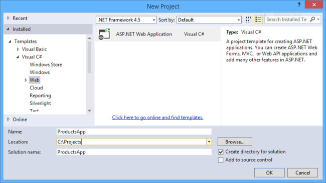
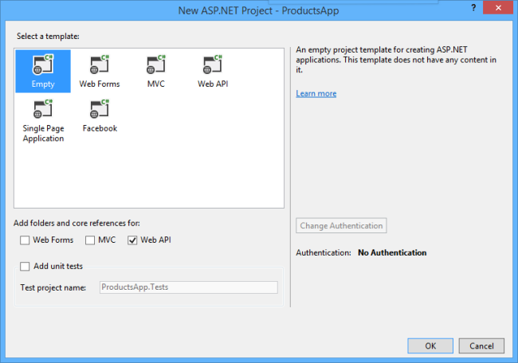

### Create a Web API Project

Start Visual Studio and select 
**New Project** <!-- .element class="highlight highlight-blue" --> 
from the Start page.  
Type **asp net** <!-- .element class="highlight highlight-blue" --> 
in the search box on the top right and select  
**ASP.NET Web Application** <!-- .element class="highlight highlight-red" -->
for **Visual C#**

