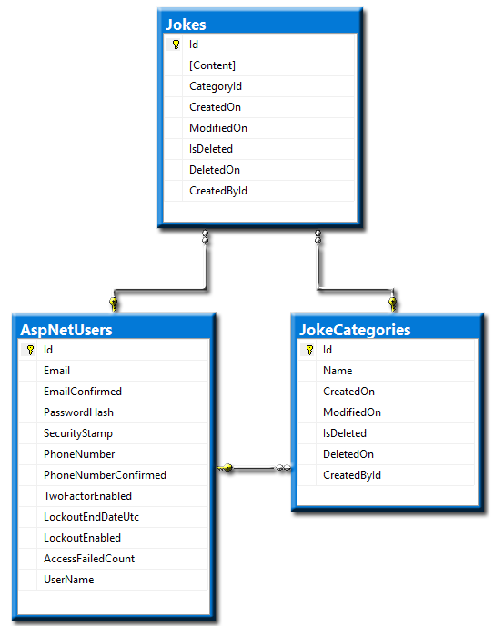

<!-- .element class="text-left" -->
### Creating A Database

The database stores our data. In this case information about
**Products** <!-- .element class="text-success" -->  
All successfully created products are stored in the 
database, and can be modified or deleted.


### About Relational Databases

<q>We are tables that can relate to one other</q>

* Relational
    * **SQL** <!-- .element class="text-info" --> - 
    *Structured Query Language*
* Tables
* Primary Key
* Foreign Key
* Constraints

Notes:
Virtually all relational database systems use SQL (Structured 
Query Language) as the language for querying 
and maintaining the database.
Relational database strictly uses relations to store data.
A relational database matches data by using common characteristics
found in the dataset. And the resulting group is termed as Schema.

Entity tables represents objects from the real world
Columns are the characteristics of the entities, they have name
and type, for example Students would have Name(text), Faculty
Number(number), Photo (binary), Date of enlistment (date)
Relationships are dependencies between the tables
Students are trainer in courses - many to many
Courses are held in towns - can be many to many or many to one

For easier and quick access data models must have some unique 
characteristic to be easily distinct and found in the database records. 
This is called the **primary key** and most often it is the **Id**
of the model but not necessarily
How to chose a primary key, rule of thumb - always define a primary key
Use `identity` to implement auto-increment

Other constraints can be minimum/maximum length start/end date to be
unique and others
Since each row in a table has its own unique key, rows in a table can
be linked to rows in other tables by storing the unique key of the row
to which it should be linked (where such unique key is known as a “foreign key”).


### Database Diagram


<!-- .element class="big-img" -->


### SQL Query Demo

```sql
SELECT    EmployeeID, FirstName, LastName, HireDate, City 
FROM      Employees
WHERE     City IN ('Seattle', 'Tacoma', 'Redmond')
ORDER BY  City DESC
```

```sql
SELECT    EmployeeID, FirstName, LastName, HireDate, City
FROM      Employees
WHERE     HireDate BETWEEN '1-june-1992' AND '15-december-1993'
```

```sql
INSERT INTO Projects(Name, StartDate)
VALUES     ('New Project', GETDATE())
```

```sql
UPDATE    Employees
SET       Salary = Salary * 1.10,
          JobTytle = 'Senior ' + JobTitle
WHERE     DepartmentID = 3
```


### Options

* SQLite
* Microsoft SQL Server

* Database First
* Code First


<!-- .element class="text-left" -->
### SQLite

*economy* <!-- .element class="label label-info" -->
*efficiency* <!-- .element class="label label-primary" -->
*reliability* <!-- .element class="label label-success" -->
*independence* <!-- .element class="label label-warning" -->
*simplicity* <!-- .element class="label label-danger" -->  
  
* Embedded devices and the internet of things
* Application file format
* Websites

SQLite works great as the database engine for most low to medium 
traffic websites (which is to say, most websites).  
Generally speaking, any site that gets fewer than
 <!-- .element class="fragment" -->
**100K hits/day** <!-- .element class="highlight highlight-red" -->
should work fine with SQLite.

<q class="fragment">The SQLite website
(https://www.sqlite.org/) uses SQLite itself, of 
course, and as of 2015 it handles about 400K to 500K
HTTP requests per day</q>

Notes:
SQLite a self-contained, serverless, zero-configuration, 
transactional SQL database engine, it is not directly comparable to 
client/server SQL database engines
such as MySQL, Oracle, PostgreSQL, or SQL Server

Because an SQLite database requires no administration, it works well 
in devices that must operate without expert human support. SQLite
is a good fit for use in cellphones, set-top boxes, televisions,
game consoles, cameras, watches, kitchen appliances, thermostats,
automobiles, machine tools, airplanes, remote sensors, drones, 
medical devices, and robots: the "internet of things".
Embedded devices: think of devices of which you can only remove
the battery at most

SQLite is often used as the on-disk file format for desktop
applications such as version control systems, financial analysis
tools, media cataloging and others.
There are many benefits to this approach, including improved
application performance, reduced cost and complexity, and improved reliability.


<!-- .element class="text-left" -->
### Microsoft SQL Server

<q>SQL Server is the foundation of Microsoft's data platform, delivering 
mission-critical performance with in-memory technologies and faster
insights on any data, whether on-premises or in the cloud.</q>

\# said
<!-- .element class="fragment" style="text-align: right" --> 
"*Microsoft*" <!-- .element class="text-info" -->

*scalability* <!-- .element class="label label-info" -->
*concurrency* <!-- .element class="label label-primary" -->
*centralization* <!-- .element class="label label-success" -->
*control* <!-- .element class="label label-danger" -->

* **T-SQL** <!-- .element class="text-info" --> -
Transact-SQL, an extension of SQL

* **SQL Server** <!-- .element class="text-info" --> - 
the database engine, executes SQL/T-SQL queries


<!-- .element class="text-left" -->
### Database First

This is a database modeling technique which involves creating the
database either by manipulating E/R Diagrams inside a **workbench** or
**management studio** and/or by defining the database layout using SQL.

Then importing the database to our project in **Visual Studio** 

*If we already have an existing database we are likely to use this
approach*


<!-- .element class="text-right" -->
### Code First

This is a database modeling technique that creates the database schema 
programmatically 
<!-- .element class="text-left" -->

It allows us to create a database by defining it in a familiar language 
and minimal knowledge of SQL. The interaction with the database is
done through an ORM Service/Framework
<!-- .element class="text-left" -->

\# **ORM** 
<!-- .element class="text-info" --> - Object-Relational Mapping


### What database modeling involves

* Identification of Entities
* Identification of Columns
* Defining a primary key for each entity table
* Identification and modeling of relationships
    * Multiplicity of relationships
* Defining other constraints
* Filling test data in the tables
