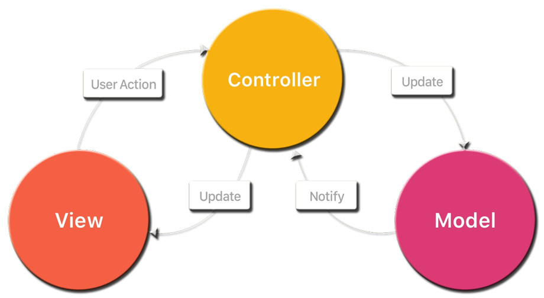

### Creating a Controller

#### Model View Controller

* **M** <!-- .element class="text-info" --> -
I'm not actually a **model** <!-- .element style="color: #dc3a75;" -->
* **V** <!-- .element class="text-info" --> -
At least I am a **view** <!-- .element class="text-danger" --> , right?
* **C** <!-- .element class="text-info" --> -
I consider myself a coordinator, but **controller** <!-- .element class="text-warning" -->
<br /> sounds more professional



Notes:
The view is the data in it's presentation form, the part the user
can interact with, the things that he's seeing.

The controller is the mediator between the view and the model, it's
the go to guy when something must be passed between them,
"can they just talk with each other why do they need a controller" - 
this would increase their responsibilities and introduce more coupling
between them, and will make them hard to modify/replace one without
also changing the other 

The confusion about the model in MVC - there are `Data` Models, 
`Request/Response` Models, `View`
Models, a lot of models, but none of them is actually the `model` 
MVC is referring to. The model in MVC is actually the business logic -
the `business model`. 

Lets review a brief example of MVC: 
An application for cars - the user enters a brand in the view it 
the tells the controller to fetch all cars from this brand, and the
controller turns to the `business model` (a service) to ask for data, 
finally the `view` is updated with the returned data


### MVC Is So Important That It Has It's Own [Song](https://youtu.be/YYvOGPMLVDo?t=1m8s)

<iframe width="840" height="472" src="https://www.youtube.com/embed/YYvOGPMLVDo" frameborder="0" allowfullscreen></iframe>


### Web API Controllers in ASP.NET

* An object that handles **HTTP** Requests
* Derive from `ApiController`
* Request to controller method mapping
    * Controller naming plays a role
* Should return `IHttpActionResult`


### Action mapping

Route template: `api/{controller}/{id}`
<br/>
<br/>

| Action            | HTTP Method | Relative URL              | Method                        |
|-------------------|-------------|---------------------------|-------------------------------|
| Get list of jokes | GET         | /api/jokes                | Get(int start, int end)       |
| Get a joke by ID  | GET         | /api/jokes/{id}           | Get(int id)                   |
| Create a joke     | POST        | /api/jokes                | Create(JokeCreateModel model) |
| Get Random Jokes  | GET         | /api/jokes/random/{count} | Random(int count)             |
<!-- .element style="font-size: 43px;" -->


### Controller Code

```C#
public class JokesController : BaseApiController
    {
        private readonly IJokesService jokes;
        private readonly ICategoriesService categories;

        public JokesController(IJokesService jokes, ICategoriesService categories)
        {
            this.jokes = jokes;
            this.categories = categories;
        }

        public IHttpActionResult Get(int start, int end)
        {
            var jokes = this.jokes.GetRange(start, end)
                .To<JokeViewModel>()
                .ToList();

            return this.Ok(jokes);
        }

        public IHttpActionResult Get(int id)
        {
            var joke = this.jokes.GetById(id);
            var viewModel = this.Mapper.Map<JokeViewModel>(joke);

            return this.Ok(viewModel);
        }

        [Authorize]
        [HttpPost]
        public IHttpActionResult Create(JokeCreateModel model)
        {
            if (this.ModelState.IsValid == false)
            {
                return this.BadRequest(this.ModelState);
            }

            return this.TryCreateJoke(model);
        }

        [HttpGet]
        [Route("api/jokes/random/{count:int:min(1)}")]
        public IHttpActionResult Random(int count)
        {
            var jokes = this.jokes.GetRandomJokes(count)
                .To<JokeViewModel>()
                .ToList();

            return this.Ok(jokes);
        }
    }
```
<!-- .element class="code code-large" -->